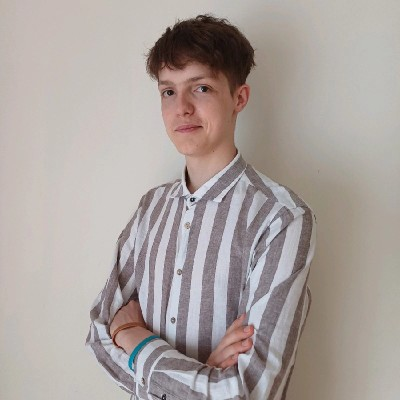
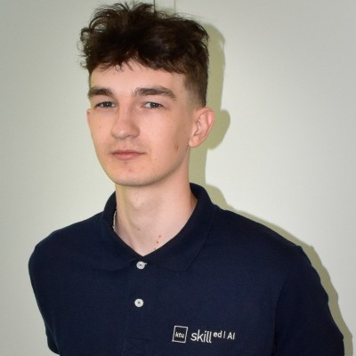
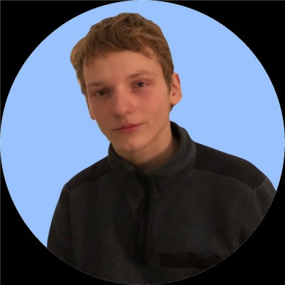

The Kath project is an ongoing effort driven by a passionate group of developers working collaboratively to achieve shared goals. Below, we highlight the currently active team members and their respective teams. These teams ensure a well-rounded development process, covering essential areas such as communication, frontend, backend, and individual work.

> [!note] Color Legend
> To help you quickly identify the status of project members, we've color coding for that.
> - **Green** - currently active members contributing to the project.
> - **Yellow** - members who are currently inactive due to various circumstances.
> - **Red** - for those who have left the project.

---

## Communications Team

The Communications Team ensures smooth collaboration between developers and advisors. They handle documentation initiations, facilitate meetings, manage external communications, and ensure that everyone is aligned with the project’s goals.

<!-- COMMUNICATIONS TEAM -->
<!-- Team grid layout -->

    <!-- KAZIMIERAS BAGDONAS -->
    <!-- Member card -->
    

        <!-- Details container -->
        

            <!-- Avatar container -->
            

                

                    

                    <!-- Avatar -->
                    
                

            

            <!-- Text container -->
            

                <!-- Name -->
                
Kazimieras

                <!-- Surname -->
                
Bagdonas

                <!-- Role -->
                
Project Mentor

                <!-- Text -->
                
Product Security Engineer / Software Engineer @ QuaDigi / Dräger Assistant prof. @ KTU.

            

        

        <!-- Links container -->
        

            <!-- LinkedIn link -->
            
        

    

    <!-- EIMANTAS ŠIBURKIS -->
    

        

            

                

                    

                    
                

            

            

                
Eimantas

                
Šiburkis

                
Communications Manager

                
Business digitalization managment | KTU.

            

        

        

            
        

    

    <!-- IGNAS SABALIAUSKAS -->
    

        

            

                

                    

                    
                

            

            

                
Ignas

                
Sabaliauskas

                
Communications Manager

                
Thinking-outside-the-box - that is what I do best.

            

        

        

            
        

    

---

## Frontend Team

The Frontend Team focuses on building user-facing interfaces, ensuring accessibility, responsiveness, and an intuitive user experience. Their work includes creating and maintaining the visual aspects of the project.

<!-- FRONTEND TEAM -->

    <!-- MANTVYDAS DELTUVA -->
    

        

            

                

                    

                    
                

            

            

                
Mantvydas

                
Deltuva

                
Lead Frontend Developer

                
It’s not a bug. It’s an undocumented feature. – Anonymous

            

        

        

            
            
        

    

    <!-- JUSTINAS TESELIS -->
    

        

            

                

                    

                    
                

            

            

                
Justinas

                
Teselis

                
Frontend Developer

                
Student. Software Developer. Graphic Designer.

            

        

        

            
            
        

    

---

## Backend Team

The Backend Team handles the project's core logic, server-side functionality, and database operations. They are responsible for ensuring that the systems are scalable, secure, and reliable.

<!-- BACKEND TEAM -->

    <!-- VLADYSLAV LEVCHENKO -->
    

        

            

                

                    

                    
                

            

            

                
Vladyslav

                
Levchenko

                
Backend Developer

                
Informatics Student at Kaunas University of Technology.

            

        

        

            
            
        

    

    <!-- KAJUS ČERNIAUSKAS -->
    

        

            

                

                    

                    
                

            

            

                
Kajus

                
Černiauskas

                
Backend Developer

                
Simple answer is my Linkedin.

            

        

        

            
            
        

    

    <!-- MARIUS PETRAUSKAS -->
    

        

            

                

                    

                    
                

            

            

                
Marius

                
Petrauskas

                
Backend Developer

                
Linux.

            

        

        

            
        

    

    <!-- NOJUS SAJAUSKAS -->
    

        

            

                

                    

                    
                

            

            

                
Nojus

                
Sajauskas

                
Backend Developer

                
I enjoy it when my created programs fulfills the purpose. This is how I expect changes in the world to begin.

            

        

        

            
            
        

    

---

## Individual Work

Individual contributors are members working independently on specific parts of the project or providing enhanced functionality in areas outside the defined teams.

<!-- INDIVIDUAL WORK -->

    <!-- PAULIUS PREIKŠA -->
    

        

            

                

                    

                    
                

            

            

                
Paulius

                
Preikša

                
Developer

                
Junior Microsoft Dynamics NAV / Business Center consultant - developer.

            

        

        

            
            
        

    

---

## Previous Contributors

This section is dedicated to recognizing and thanking team members who were once a part of the Kath project but have since moved on. We deeply appreciate their efforts and wish them the best in their future endeavors.

    <!-- DAINIUS KIRSNAUSKAS-->
    

        

            

                

                    

                    
                

            

            

                
Dainius

                
Kirsnauskas

                
Lead Backend Developer

                
The project name "KATH" is an acronym derived from the first letters of KTU and Harvard (KT + Ha → KTHA → KATH).

            

        

        

            
            
        

    

<!-- CSS -->
