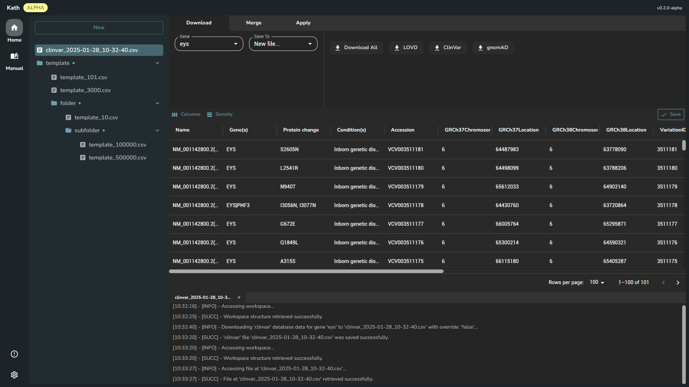

---

## Overview

**_Kath_ is a user-friendly GUI tool designed to streamline the in-depth analysis of gene variation data from LOVD, gnomAD, and ClinVar genetic databases**. By consolidating critical information into an accessible interface, _Kath_ empowers researchers, clinicians, and geneticists to uncover actionable insights with ease.

Built for efficiency and adaptability, it is ideal for tasks such as assessing pathogenicity or cross-referencing genetic variant data. It serves as a vital tool for advancing research, improving diagnostics, and supporting genomic studies.

---

## Documentation

Comprehensive and detailed documentation is provided to support all users, developers, and system administrators throughout the _Kath_. Whether you’re a first-time user, a contributor to the project, or managing the deployment and maintenance of _Kath_, our resources are designed to guide you at every step.

### User Manual

![[manual/index.md#^summary]]

### System Deployment

![[deployment/index.md#^summary]]

### Project Development

![[development/index.md#^summary]]

---

## Advisors

We are honored to recognize the contributions of our advisors who **bring expertise, resources, and guidance to the development of _Kath_**. Their support is instrumental in ensuring the quality, innovation, and impact of our tool in the field of genetics.

    

        <a href="https://www.harvard.edu">
            
            
Harvard University

        </a>
        

            Leading institution in education and research.
        

    

    

        <a href="https://genomika.lt">
            
            
Genomika Lietuva

        </a>
        

            Innovative solutions in genomics and biotechnology.
        

    

<!-- CSS -->

